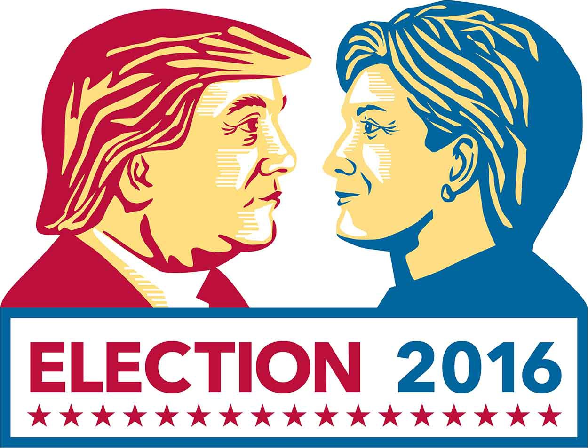
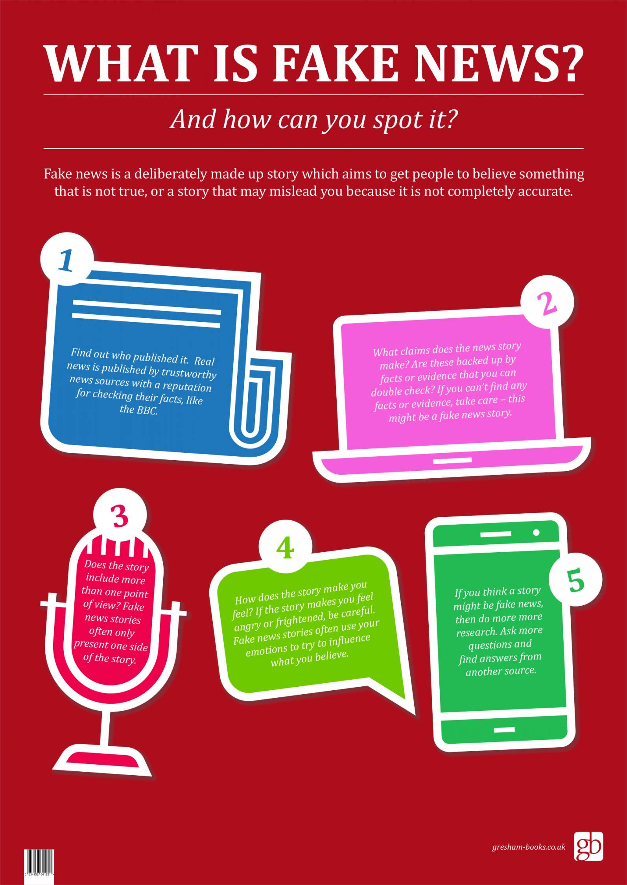

# Fake-News-Detector
Bullet Points:
* This project is a medium with which we can
deal with the dissemination of fake news.
* The goal of this project is to filter out fake
news from the real story.
* Currently, the Scope of the project is to filter
the news based on the title of the news.
# Background
Fake news is now viewed as one of the greatest threats to democracy, journalism, and freedom of
expression. It has weakened public trust in governments and its potential impact on the
contentious “Brexit” referendum and the equally divisive 2016 U.S. presidential election – which it
might have affected– is yet to be realized. The reach of fake news was best highlighted during the
critical months of the 2016 U.S. presidential election campaign, where the top twenty
frequently-discussed false election stories generated 8,711,000 shares, reactions, and comments
on Facebook, ironically, larger than the total of 7,367,000 for the top twenty most-discussed
election stories posted by 19 major news websites. Our economies are not immune to the spread
of fake news either, with fake news being connected to stock market fluctuations and massive
trades. For example, fake news claiming that Barack Obama was injured in an explosion wiped
out $130 billion in stock value. These events and losses have motivated fake news research and
sparked the discussion around fake news, as observed by skyrocketing usage of terms such as
“post-truth” – selected as the international word of the year by Oxford Dictionaries in 2016.

## Impact:
The widespread propagation of false
information online is not a recent
phenomenon, but its perceived impact in
the 2016 U.S. presidential election has
thrust the issue into the spotlight. Apart
from this, fake news has been the cause of
many agitated situations and even fatalities
in many countries.

## Types
In General, The four observed flavors of “fake news”:
1) Clickbait — Shocking headlines meant to generate
clicks to increase ad revenue. Frequently these stories
are highly exaggerated or totally false.
2) Propaganda — Intentionally misleading or deceptive
articles intended to promote the author’s agenda. Often
the rhetoric is hateful and incendiary.
3) Commentary/Opinion — Biased reactions to current
events. These articles frequently tell the reader how to
perceive recent events.
4) Humor/Satire — Articles written for entertainment.
These stories are not meant to be taken seriously.

**To Read the whole Report see the document below**
 [[Project Report](https://github.com/ksw25/Fake-News-Detector/blob/master/Fake%20News%20Project%20Report.pdf)]
